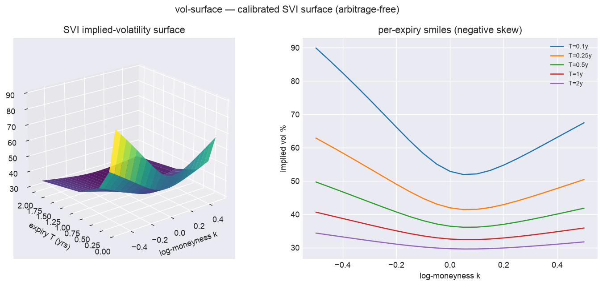

# vol-surface

[](https://github.com/superkush06/vol-surface/actions/workflows/ci.yml)
[](https://www.python.org/)
[](LICENSE)

> Implied volatility surface modelling — Black-Scholes pricing, IV solver
> (Brent), SABR (Hagan) calibration, single-slice **and multi-expiry SVI
> surface** calibration with calendar no-arbitrage, plus butterfly/calendar
> checks. Pure Python, no scipy required.



*A calendar-arbitrage-free SVI surface fit across five expiries: the 3-D vol
surface (left) and per-expiry smiles showing negative skew flattening with
maturity (right). Reproduce: `python examples/render_hero.py`.*

## TL;DR

```python
from volsurf import BlackScholes, implied_vol, fit_sabr, SABRParams, sabr_iv

bs = BlackScholes(S=100, K=105, T=0.5, r=0.02)
iv = implied_vol(market_price=4.20, bs=bs)
print(iv)  # ~0.25

# Calibrate SABR to a slice of market IVs
strikes = [80, 90, 100, 110, 120]
market_ivs = [0.28, 0.24, 0.22, 0.23, 0.27]
params = fit_sabr(F=100, T=1.0, strikes=strikes, market_ivs=market_ivs, beta=0.5)
print(params)  # SABRParams(alpha=..., beta=0.5, rho=..., nu=...)
```

## What's inside

- **`BlackScholes`** — closed-form call/put pricing + delta, gamma, vega.
- **`implied_vol`** — Brent's-method IV solver (pure Python).
- **`SABR`** — Hagan-formula IV + 3-parameter slice calibration (Nelder-Mead, scipy-free).
- **`SVI`** — raw parameterisation + total-variance / IV conversion.
- **`SVISurface`** — multi-expiry SVI calibration (`fit_svi_slice`,
  `fit_svi_surface`), T-interpolated total variance, and a
  `calendar_arbitrage_free` check.
- **No-arbitrage checks** — butterfly density positivity and calendar monotonicity.
- **Theory primer** — [`docs/theory.md`](docs/theory.md).

## Install

```bash
git clone https://github.com/superkush06/vol-surface.git
cd vol-surface
pip install -e ".[dev]"
pytest
```

## Roadmap

- [ ] Surface (multi-expiry) calibration with calendar enforcement.
- [ ] SVI Gatheral-Jacquier no-arbitrage constraints.
- [ ] Local volatility (Dupire) from a fitted IV surface.
- [ ] Heston stochastic-vol calibration via Carr-Madan FFT.

## License

MIT — see [LICENSE](LICENSE).
