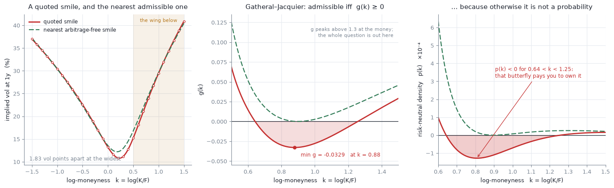
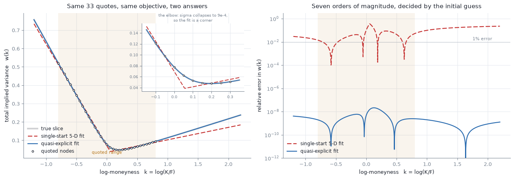
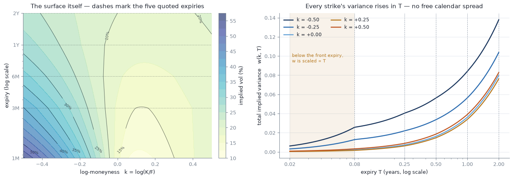

# vol-surface

[](https://github.com/superkush06/vol-surface/actions/workflows/ci.yml)

`vol-surface` fits implied-volatility smiles and surfaces: Black-Scholes,
Brent inversion, SABR, SVI, and multi-expiry surfaces. Python 3.11+, standard
library only at run time, no scipy.

A smile is one implied vol per strike, and those vols together imply a
probability distribution for the terminal price. A careless fit can imply a
distribution that goes negative over a band of strikes, and a plain fitter
will not tell you it happened. So every SVI fit here is checked against the
Gatheral–Jacquier butterfly condition before it is returned, every surface is
checked for calendar monotonicity, and the discrete arbitrage screen makes you
pass the forward instead of guessing one.



The left panel is Axel Vogt's SVI slice — Gatheral and Jacquier's standard
butterfly-arbitrage counterexample, and the point of it is that it looks like
any other smile. The middle panel evaluates Gatheral–Jacquier's $g(k)$ on it:
on the call wing $g$ reaches −0.0329, and $g \ge 0$ is exactly the condition
for the slice to come from a probability distribution. The right panel shows
what that means in prices — the density is negative for $0.642 < k < 1.256$
(the same interval the validation table reports below), so a butterfly struck
there has non-negative payoff and negative cost. The dashed green curve is the
same fit run with `butterfly_penalty=1e5`: its density is non-negative
everywhere, and the smile moves by under 2 vol points to get there. The
library reports that number and lets you decide.

## Install

```bash
git clone https://github.com/superkush06/vol-surface.git
cd vol-surface
pip install -e ".[dev]"
pytest          # 94 tests
```

The `dev` extra pulls in pytest, ruff, and numpy. numpy is not used by
`volsurf` itself — only by `examples/validate.py`. The figures need a second
extra, `.[plot]`; see [Reproducing everything](#reproducing-everything).

## Price, and invert

```python
from volsurf import BlackScholes, implied_vol

bs = BlackScholes(S=100, K=105, T=0.5, r=0.02)
bs.price(0.21)              # 4.262343883855685
implied_vol(4.2623438, bs)  # 0.20999999697496546
bs.vega(0.21)               # 27.720639344633113
```

The solver is bracketed, not Newton: vega vanishes in the wings, so a Newton
step there diverges. If the vol falls outside the bracket, the error says
which end it fell off — which matters for short-dated names:

```python
implied_vol(45.0, BlackScholes(S=100, K=200, T=0.02))
# IVSolverError: implied vol exceeds the upper bracket hi=5.0: the option
# price at sigma=5.0 is still below the market price (short-dated / event
# vols can do this — pass a larger `hi`)
```

## Calibrate

`fit_svi_slice` takes log-moneyness and total variance and returns raw SVI
parameters. Here it recovers a steep single-name skew from 33 quotes:

```python
from volsurf import SVIRawParams, fit_svi_slice, svi_w, svi_min_g

truth = SVIRawParams(a=0.01, b=0.35, rho=-0.70, m=0.05, sigma=0.15)
ks = [-0.8 + 0.05 * i for i in range(33)]
ws = [svi_w(k, truth) for k in ks]

fit = fit_svi_slice(ks, ws)
print(fit)
# SVIRawParams(a=0.009999998119432167, b=0.350000003216198,
#              rho=-0.7000000007983059, m=0.049999995602301256,
#              sigma=0.1500000095737906)

svi_min_g(fit, -0.8, 0.8)
# (0.08150882562974118, -0.40800000000000003)   <- min g > 0: admissible
```

Four of the five parameters come back to seven significant figures or better
($\rho$ and $b$ to eight); $a$ comes back to six, at a relative error under
$5\times10^{-7}$. That is not what a five-parameter smile fit usually gives,
and it is not because the optimiser is good.



Raw SVI has a deep local minimum where the elbow collapses to a corner:
$\sigma \to 0$, $\rho \to -1$. A single-start Nelder-Mead on all five
parameters falls into it from an ordinary initial guess and reports
convergence at $\sigma = 9.4\times10^{-4}$, $\rho = -0.78$, with 33% relative
error on the very nodes it was fitting. The inset shows the corner.
`fit_svi_slice` uses the De Marco/Zeliade reduction instead: for fixed
$(m, \sigma)$ the remaining three parameters are a linear least-squares
problem, solved exactly by a 3×3 system, so only a two-dimensional outer
search remains. Same data, same objective, same machine — max relative error
$2.1\times10^{-8}$ against 33%, seven orders of magnitude, decided by how the
search was posed.

## Screen

Butterfly and calendar arbitrage, on fitted slices and on raw quotes:

```python
from volsurf import SVIRawParams, svi_min_g, svi_density, fit_svi_slice, svi_w

vogt = SVIRawParams(a=-0.0410, b=0.1331, rho=0.3060, m=0.3586, sigma=0.4153)

svi_min_g(vogt, -1.5, 1.5)      # (-0.03284957801623974, 0.8849999999999998)
svi_density(0.879, vogt)        # -0.0001164209835789834   <- negative

ks = [-1.5 + 0.05 * i for i in range(61)]
fit_svi_slice(ks, [svi_w(k, vogt) for k in ks])
# ButterflyArbitrageWarning: fitted SVI slice admits butterfly arbitrage:
#   min g(k) = -0.03283 < 0 on [-1.5, 1.5] (consider butterfly_penalty > 0)
```

On raw quotes the check is a finite-difference second derivative of price, so
it needs a forward. Which butterflies are mispriced depends on where the
distribution sits, and the same seven quotes answer differently:

```python
from volsurf import butterfly_violations

strikes = [70, 80, 90, 100, 110, 120, 130]
ivs = [0.4308, 0.4065, 0.3218, 0.2787, 0.2548, 0.2533, 0.2780]

butterfly_violations(strikes, ivs, T=0.5, forward=100.0)   # [1]
butterfly_violations(strikes, ivs, T=0.5, forward=85.0)    # []
```

The 70/80/90 butterfly costs −0.392 at a forward of 100 and +0.107 at 85.
`forward` is a required argument for that reason: there is no sensible
default, and a screen that picks one silently returns the wrong answer.
`examples/screen_for_arbitrage.py` prints both costs.

## Surfaces

`fit_svi_surface` fits one slice per expiry and stitches them with
total-variance interpolation. Total variance is the coordinate in which the
calendar condition is a simple ordering.



The left panel is an index-like surface fitted from 21 strikes at each of five
expiries: iso-vol contours over log-moneyness and maturity, put skew steep at
one month and flatter at two years. The right panel asks the one question that
couples the expiries — does total variance rise in $T$ at every strike? Every
curve is increasing, so `calendar_arbitrage_free()` returns `True`. Below the
front expiry $w$ is scaled proportionally to $T$; clamping it flat instead, as
a naive implementation does, sends implied vol to infinity as $T \to 0$.

`examples/fit_surface.py` runs that calibration with 25 bp of noise on every
quote and prints the fitted parameters, the per-slice residuals (10.3–14.4 bp),
both arbitrage checks, and a vol at nine months, where nobody quoted.

## Checked against external references

Testing a library against itself only shows it is self-consistent.
[`docs/validation.md`](docs/validation.md) is the other kind of evidence: each
row compares `volsurf` to something outside it — a closed form stated in the
source paper, a limit the model has to collapse to, a Monte Carlo of the SDE
the formula only approximates, or a second screen sharing no code with the
first. A few of the rows:

| Claim | Ours | Reference |
| --- | --- | --- |
| SABR at the money, over 2,000 random parameter sets | rel err `2.6e-15` | Hagan et al. (2002), `σ_B(f,f)` written out from the paper |
| SABR vols against the SABR SDE at `ν²T = 0.16` | `+1.5 bp` at the money | conditional Monte Carlo, s.e. `1.0 bp` |
| SABR vols against the SABR SDE at `ν²T = 3.2` | **`+393 bp`** at the money | the same simulation, s.e. `2.2 bp` |
| `g(k)` far in the wing | max err `3.0e-08` | `1/4 - b²(1+ρ)²/16`, non-negative iff `b(1+ρ) ≤ 2` — Lee (2004) |
| SSVI slices inside the Gatheral–Jacquier conditions | min `g` = `+0.003137`, 0 violations in 500 near-boundary draws | `g(k) ≥ 0` |
| The two butterfly screens on the Vogt slice | `g < 0` on `k ∈ [0.642, 1.256]` | prices flag `k ∈ [0.650, 1.250]` |

The third row is the one to read. `sabr_iv` matches Hagan's own at-the-money
expression to fourteen digits — that is what a max relative error of `2.6e-15`
buys — and is four vol points away from the model that expression approximates,
because at `ν²T = 3.2` the expansion has left its regime. That is a property of
the formula, not an error in the transcription, and `docs/validation.md` gives
the numbers for it. It also gives the `4 bp` the library gives up in the far
wing by shipping Hagan's `z` instead of Obłój's `ζ`.

```bash
PYTHONPATH=. python examples/validate.py   # prints every number in that doc
```

Separately, `tests/test_properties.py` asserts invariants rather than fixtures:
put-call parity, the static bounds, Greeks against differences of the price,
`∂²C/∂K²` against the lognormal density, SABR's scale invariance and its
`β = 0` reflection symmetry, the SVI density's unit mass and martingale
condition, and the fitter's recovery of random parameter draws — all on seeded
pseudo-random inputs.

## Where this sits

This is the volatility layer of a set of small libraries, and it stops at the
vol. Downstream, `optune` prices and differentiates contracts (trees, Monte
Carlo, exotic payoffs, AAD Greeks) and needs one vol per contract; `risk`
turns a vector of scenario P&L into VaR and expected shortfall. Neither knows
how to turn a screen of quotes into a vol at a strike and expiry nobody
listed. That is what this repo does, and it is all it does.

`examples/greeks_handoff.py` walks the join end to end on an invented but
plausible quote screen: fit, screen for both arbitrages, mark a five-position
book (one leg at an expiry with no listed quotes), then shock spot and surface
together and hand out a P&L vector:

```
scenario P&L (spot and surface shocked together)
  scenario                 spot    ATM 3M vol    P&L      arb-free
  base                    412.50      23.29%          +0    True
  spot -10%, vol +35%     371.25      31.71%  +1,003,575    True
  spot -5%, vol +15%      391.88      26.90%    +379,740    True
  spot -2%, vol +5%       404.25      24.49%    +125,087    True
  spot flat, vol -8%      412.50      21.40%     -18,097    True
  spot +2%, vol -6%       420.75      21.86%    -106,343    True
  spot +5%, vol -12%      433.12      20.44%    -254,435    True
  spot +10%, vol -18%     453.75      19.02%    -601,734    True
```

It imports nothing from the sibling repos: the pricing is this library's own
`BlackScholes` and the loss statistics are computed inline, because the point
is to show the shape of the handoff. The shocks are applied to the SVI
parameters rather than to the vols, so every shocked surface can be run back
through the same arbitrage screens; the last column is that check.

## What is in here

| Module | What it gives you |
| --- | --- |
| `black_scholes.py` | Closed-form prices plus delta, gamma, vega. |
| `iv.py` | Brent inversion, with arbitrage-bound rejection and a bracket error that names the end you fell off. |
| `sabr.py` | Hagan implied vol through a single code path: the near-ATM `z/x(z)` factor comes from its Taylor series, so there is no branch and no step. |
| `sabr_fit.py` | Three-parameter slice calibration at fixed β, grid init plus Nelder-Mead. |
| `svi.py` | Raw SVI, `svi_g`, `svi_density`, `svi_min_g`, `svi_butterfly_arbitrage_free`. |
| `surface.py` | Quasi-explicit slice calibration, `SVISurface`, both arbitrage checks, `butterfly_penalty`. |
| `noarb.py` | Discrete screens on raw quotes: butterfly at an explicit forward, calendar across two expiries. |

The derivations, the reason each algorithm was chosen, and the references are
in [`docs/theory.md`](docs/theory.md).

## What it does not do

- **Enforce the calendar condition.** Slices are fitted independently and the
  ordering is checked afterwards. Enforcing it during calibration means a fit
  coupled across expiries — SSVI is the usual route, and it is not here.
- **Guarantee an arbitrage-free fit.** `butterfly_penalty` is a soft penalty,
  not a projection. On the Vogt slice it lands `min g(k)` above zero but
  below `1e-05`, which is non-negative without being non-negative by
  construction. The exact residual is a soft-penalty artefact and moves in the
  last digits between platforms, so the bound is what is claimed here rather
  than a pinned value.
- **Vectorise.** Everything is scalar Python. Calibration is comfortable; a
  Monte Carlo inner loop would not be.
- **Local volatility.** Dupire from `w(k, T)` is the natural next thing and
  the total-variance machinery is already in place, but the piecewise-linear
  interpolation in `T` is too coarse a `dw/dT` to be worth shipping.

## Reproducing everything

```bash
PYTHONPATH=. python examples/fit_sabr.py            # SABR fit + the ATM limit
PYTHONPATH=. python examples/fit_surface.py         # five expiries, end to end
PYTHONPATH=. python examples/screen_for_arbitrage.py  # all three screens
PYTHONPATH=. python examples/greeks_handoff.py      # quotes -> Greeks -> P&L
PYTHONPATH=. python examples/validate.py            # docs/validation.md, live
pip install -e ".[plot]" && python docs/figures.py  # every figure above
```

`validate.py` runs a Monte Carlo and is the slow one: twelve consecutive runs
here took 11.4–16.3 s, median 12.2 s, on an 8-core machine that was not idle
(load average 4.3). Wall-clock is load-sensitive, so read that as tens of
seconds rather than a promise. `figures.py` took 1.2–1.5 s over six runs, and
the other four examples 0.05–0.17 s each over three runs apiece.

Every snippet and command above runs as written, and every output block in
this file is pasted from one of those runs. `volsurf` itself imports nothing
but the standard library; `validate.py` and `figures.py` are the two places
numpy appears, for Monte-Carlo paths and quadrature and for plotting, and they
are scripts rather than package code.

## License

MIT — see [LICENSE](LICENSE).
